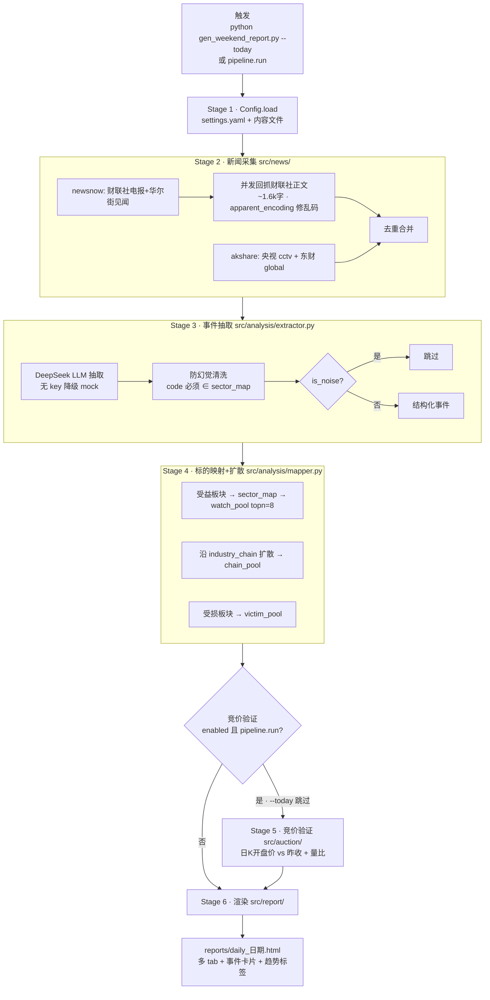
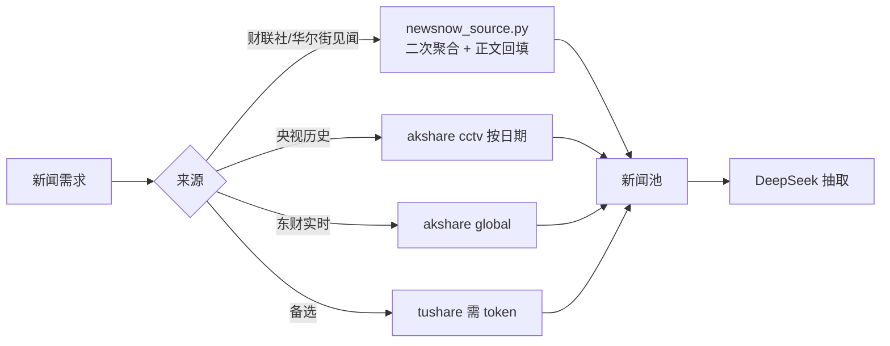

# event-driven-report · 全流程（维护者向）

> 本文件供**维护者**阅读，描述事件驱动报告 pipeline 的完整数据流。skill 正文（SKILL.md）覆盖使用方法，本图覆盖内部链路，方便排查与扩展。

## 一、完整链路

## 二、数据源路由

## 三、红线落点

| 红线 | 落在哪个文件 | 实现方式 |
|------|-------------|----------|
| 不预测股价 | `src/analysis/extractor.py` | sentiment 字段仅描述事件因果方向，全链路无买卖信号/目标价 |
| 防未来函数 | `src/auction/analyzer.py` | 竞价验证只取事件日**之前**已公开的日K，不偷看事件后涨跌 |
| 防幻觉 | `src/analysis/extractor.py` `_sanitize` | 标的 code 强制 ∈ sector_map.json，编造代码一律丢弃 |
| 不编造数据 | 各 source/fetcher | 接口失败返回 None 或"数据暂缺"，不填估数 |

## 四、路径定位（搬迁/移植要点）

所有路径都基于 `Path(__file__).resolve().parents[N]`，**无绝对路径、无硬编码**：

| 文件 | 定位方式 | 含义 |
|------|----------|------|
| `src/config.py` | `Path(settings_path).resolve().parent.parent` | settings.yaml 的上上级 = skill 根 |
| `src/auction/fetcher.py` | `Path(__file__).resolve().parents[2]` | src/auction/x.py 的上两级 = skill 根 |
| `src/strategy/scoring.py` | `Path(__file__).resolve().parents[2]` | 同上 |
| `scripts/gen_weekend_report.py` | `Path(__file__).resolve().parent.parent` | scripts/x.py 的上级 = skill 根 |

**结论**：只要 `scripts/ src/ config/ data/` 四目录平级在 skill 根下，整套代码可在任意路径运行，无需改动。`reports/` 运行时自动创建。

## 五、依赖分层（见 requirements.txt）

- **必需**（`--today` 启动瞬间触发）：pyyaml, pydantic, requests, pandas, numpy, akshare
  - 注意 `akshare` 是 `src/auction/fetcher.py:55` 的**模块级 eager import**（经 `trend_tags → fetcher` 链在启动时触发），不是可选。
- **可选**（特定模式才 import）：openai（真实 LLM，无则降级 mock）、tushare（backend=tushare 且有 token）、baostock（分钟K回测，pipeline 不触发）

## 六、与 finance-report 的边界

| 维度 | finance-report | event-driven-report（本 skill） |
|------|----------------|-------------------------------|
| 定位 | 宏观综述 / 日报周报 | 事件驱动 / 标的映射 |
| 形态 | 轻量指引（方法论 + 仅标准库脚本） | 重型自包含包（完整 Python pipeline） |
| 数据采集 | web_search + web_fetch | newsnow/akshare 直采 + LLM 抽取 |
| 产出 | 飞书云文档 | 本地 HTML |
| 触发词 | 财经日报/周报/市场综述 | 事件驱动/盘前扫描/标的映射/催化扫描 |

二者互补：finance-report 回答"今天市场发生了什么"，本 skill 回答"这条新闻利好哪些标的、资金确认了没有"。
