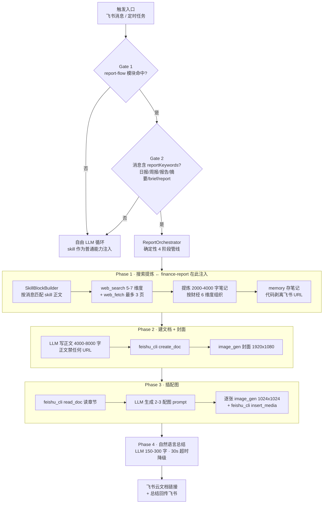
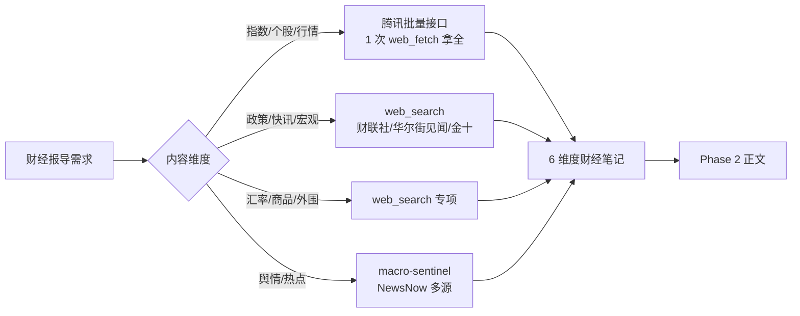

# 财经报导 → 飞书云文档 · 全流程

> 本文件供**维护者**阅读，描述 `finance-report` skill 所嵌入的完整报告管线。
> skill 正文（SKILL.md）只覆盖 Phase 1；本图覆盖全链路，方便排查与扩展。

## 一、完整链路



## 二、Phase 1 财经数据源路由



> web_fetch 全管线硬上限 3 次。**必须批量**（腾讯接口一次拿 N 只），否则会浪费在单只个股上、漏掉汇率与商品。

## 三、触发词与"进不了管线"的陷阱

skill 触发词只覆盖**能进报告管线**的说法（Gate 2 的 reportKeywords 含 `日报/周报/报告/摘要/report/brief`）：

```
财经日报 / 财经周报 / 市场日报 / 财经报告 / 财经分析报告 / 财经摘要 / finbrief / finance report
```

**以下高频说法目前进不了报告管线**（reportKeywords 不含它们，会落到自由 LLM，此时本 skill 的「Phase 1」声明不成立）：

```
财经早报 / 晨报 / 盘后总结 / 盘前参考 / 收盘总结 / 财经简报 / 财经报导
```

若要支持这些说法，需改 Claw 代码（不在本 skill 范围）：
- `FeishuWebhook.cs` 的 `reportKeywords` 数组加词：`早报 / 晨报 / 盘后 / 盘前 / 收盘 / 简报 / 报导`
- 同步在 `PromptModuleSelector.cs` 的 `report-flow` 关键词里加上对应词，保持两道 Gate 一致

## 四、与兄弟 skill 的边界

| Skill | 职责 | 触发词特征 |
|-------|------|-----------|
| **finance-report**（本 skill） | 维度编排 + web_fetch 预算 + 财经红线 | 财经日报 / 周报 / 报告 |
| stock-data | A 股个股行情接口（腾讯 / 新浪）字段与解析 | 股价 / 股票 / 行情 / A股 |
| macro-sentinel | 宏观舆情分析、行业热力图、方向判断 | 宏观 / 舆情 / 热点 / 行业 / 板块 |
| quant-analyst | 量化策略、回测、因子 | 量化 / 回测 / 策略 / 因子 |

> 多个 skill 可在 Phase 1 **同时注入**（SkillSelector 无优先级去重，各自独立打分 ≥5 即展开）。本 skill 正文已声明「行情细节用 stock-data、舆情用 macro-sentinel」，避免重复采集。

## 五、依赖

本 skill 仅在 **Hermes / Yubo.AI.Claw 报告管线**内有效，依赖：

- **工具**：`web_search` / `web_fetch` / `memory`（Phase 1 直接使用）；`feishu_cli` / `image_gen`（后续阶段，本 skill 不直接调用）
- **兄弟 skill**：`stock-data`（行情接口）、`macro-sentinel`（舆情源）
- **代码**：`ReportOrchestrator`（4 阶段管线）、`SkillBlockBuilder`（Phase 1 注入）、`FeishuWebhook`（Gate 2）

## 六、安装

在 Hermes / Yubo.AI.Claw 的 skill 商店安装，GitHub 源填：

```
LoganChi/hermes-finance/skills/finance-report
```

安装后位于 `Skills/store-finance-report/`，`meta.json` 的 `Enabled` 控制是否加载。
