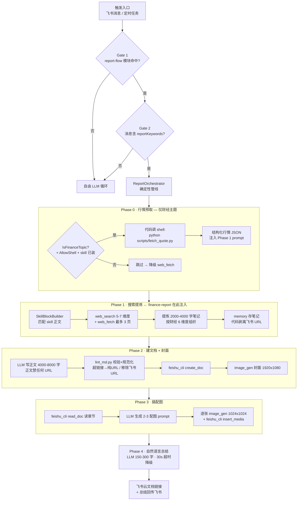
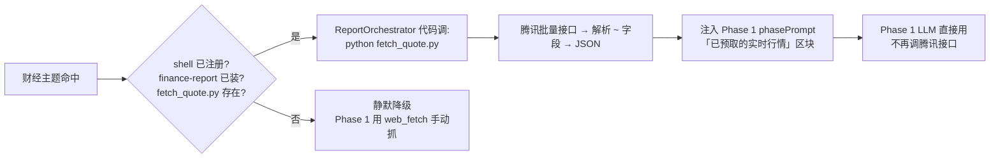
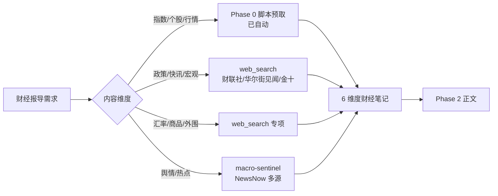

# 财经报导 → 飞书云文档 · 全流程

> 本文件供**维护者**阅读，描述 `finance-report` skill 所嵌入的完整报告管线（含 Phase 0 行情预取）。
> skill 正文（SKILL.md）只覆盖 Phase 1；本图覆盖全链路，方便排查与扩展。

## 一、完整链路



## 二、Phase 0 行情预取（脚本接入）

把"接口调用 + 字段解析"这件**确定性活**从 LLM 手里拿走，交给 `scripts/fetch_quote.py`：



**关键设计**：
- **代码调脚本，不是 LLM 调**（模式同 `PptOrchestrator.cs:374-409`）。LLM 全程不碰 shell 命令，安全。
- 触发条件三选一不满足即跳过：①消息含财经关键词（`IsFinanceTopic`）②`ToolingConfig.AllowShell=true` ③`finance-report` skill 已安装且 `scripts/fetch_quote.py` 存在。
- 脚本输出 UTF-8 JSON（`sys.stdout.reconfigure`），`ShellTool` 按 UTF-8 读 stdout，编码链路对齐。
- 脚本定位：`ReportOrchestrator` 通过 `_allSkills` 找 `finance-report` 的 `Location`，拼 `scripts/fetch_quote.py`。

## 三、Phase 1 数据源路由（行情由 Phase 0 预取，其余维度 LLM 采集）



## 四、触发词与"进不了管线"的陷阱

skill 触发词只覆盖**能进报告管线**的说法（Gate 2 的 reportKeywords 含 `日报/周报/报告/摘要/report/brief`）：

```
财经日报 / 财经周报 / 市场日报 / 财经报告 / 财经分析报告 / 财经摘要 / finbrief / finance report
```

**以下高频说法目前进不了报告管线**（reportKeywords 不含它们，会落到自由 LLM，此时本 skill 的「Phase 1」声明不成立）：

```
财经早报 / 晨报 / 盘后总结 / 盘前参考 / 收盘总结 / 财经简报 / 财经报导
```

若要支持这些说法，需改 Claw 代码（不在本 skill 范围）：
- `FeishuWebhook.cs` 的 `reportKeywords` 数组加词：`早报 / 晨报 / 盘后 / 盘前 / 收盘 / 简报 / 报导`
- 同步在 `PromptModuleSelector.cs` 的 `report-flow` 关键词里加上对应词，保持两道 Gate 一致

## 五、与兄弟 skill 的边界

| Skill | 职责 | 触发词特征 |
|-------|------|-----------|
| **finance-report**（本 skill） | 维度编排 + web_fetch 预算 + 财经红线；附 `fetch_quote.py` 行情预取脚本 | 财经日报 / 周报 / 报告 |
| stock-data | A 股个股行情接口（腾讯 / 新浪）字段与解析 | 股价 / 股票 / 行情 / A股 |
| macro-sentinel | 宏观舆情分析、行业热力图、方向判断 | 宏观 / 舆情 / 热点 / 行业 / 板块 |
| quant-analyst | 量化策略、回测、因子 | 量化 / 回测 / 策略 / 因子 |

> 多个 skill 可在 Phase 1 **同时注入**（SkillSelector 无优先级去重，各自独立打分 ≥5 即展开）。本 skill 正文已声明「行情细节用 stock-data、舆情用 macro-sentinel」，避免重复采集。

## 六、依赖与适配

**通用能力**（任意 agent 框架都需要）：网页搜索、网页抓取、执行脚本（python）、创建云文档、插入配图、图像生成。详见 SKILL.md 的「工具依赖」表——按职能匹配你环境里的工具，名称可不同。数据接口（腾讯行情、财联社等）受网络/区域/反爬影响，请自行验证或替换。

**运行时**：Python 3.7+（跑 `scripts/fetch_quote.py`，仅标准库）。

**Hermes / Yubo.AI.Claw 参考实现**（本流程的出处）：
- 工具：`shell`（Step 0 代码调用，需 `AllowShell=true`）/ `web_search` / `web_fetch` / `memory` / `feishu_cli` / `image_gen`
- 兄弟 skill：`stock-data`（行情字段）、`macro-sentinel`（舆情源）
- 代码：`ReportOrchestrator`（Step 0 预取 + 4 阶段管线）、`ReportPhaseState.PrefetchedMarketData`、`SkillBlockBuilder`（Phase 1 注入）、`ShellTool`、`FeishuWebhook`（Gate 2）

## 七、安装

**通用**：把 `finance-report/` 目录放进你 agent 框架的 skill 加载路径，确保能读到 `SKILL.md`。独立使用时照 Step 0→4 全跑。

**Hermes / Yubo.AI.Claw**：用 skill 商店安装，GitHub 源填：

```
LoganChi/hermes-finance/skills/finance-report
```

装好后位于 `Skills/store-finance-report/`，`meta.json` 的 `Enabled` 控制是否加载。在 Claw 报告管线内，本 skill 由 `SkillBlockBuilder` 在 Phase 1 自动注入，行情由 `ReportOrchestrator` Step 0 自动预取。
